<div align="center">

<br>
*what if things had gone differently?*

### *Upload a book. Change one thing. Watch the characters argue about it.*

[](https://www.python.org/)
[](https://nextjs.org/)
[](https://www.typescriptlang.org/)
[](https://fastapi.tiangolo.com/)
[](LICENSE)
[]()
[](#-api-keys--you-only-need-one)

### 🔗 [**See the demo →**](https://whatif-sabha.pages.dev)

</div>

---

## 🧭 Jump to

&nbsp;&nbsp;[💭 Where it came from](#-where-it-came-from) &nbsp;·&nbsp; [📖 What it does](#-what-it-does) &nbsp;·&nbsp; [📸 Guided tour](#-a-guided-tour) &nbsp;·&nbsp; [⚡ Quick start](#-quick-start) &nbsp;·&nbsp; [🔑 API keys](#-api-keys--you-only-need-one) &nbsp;·&nbsp; [🎭 How the debate works](#-how-the-debate-works) &nbsp;·&nbsp; [🔊 Voice](#-voice--every-character-has-one) &nbsp;·&nbsp; [🛠 Config](#%EF%B8%8F-config-reference) &nbsp;·&nbsp; [🧪 Tests](#-running-tests) &nbsp;·&nbsp; [🆘 Troubleshooting](#-troubleshooting)

---

## 💭 Where it came from

I've always been curious about the books I read. Some endings I just couldn't let go of — I'd keep rewriting them in my head while I was working, while I was at the gym, while I was doing dishes — and then at night they wouldn't let me sleep. Characters I'd known for years would show up in my head still going at each other, wondering out loud what they would have said if they'd got one more round on the stage.

WhatIfSabha is a side project born from that wondering. You upload a story, type a "what if", and watch the characters themselves argue it out — hosted by **Boru the Elephant**, my personal AI companion on loan to this project as moderator. You won't get the book's actual ending. You'll get a conversation between AI versions of the characters, which is a different thing, and sometimes a more interesting one.

**Why I chose Animal Farm.** I'd read it more than a decade ago, and a few questions from it never stopped bothering me — what if Snowball had come back, what if Boxer had refused the van, what if the animals had just walked away the night they saw the pigs on two legs. They were *always* there, those questions, running in the back of my head while I did other things, and every time I'd build a different theory to answer them — one day I'd land on one perspective, a week later I'd be somewhere else entirely. I've had this conversation with friends many times — they'd state their points, make their own theories, all of it. But *I* never settled. I don't think I'll settle with this app either — but each run gives me a new angle, a new perspective, something I hadn't thought of. It just makes me think more. So Animal Farm was the obvious first thing to point this at, and it's been my test bench ever since — if the moderator, the characters, the ledger all work on this one, they'll probably work on whatever book you throw at it next.

> 📝 This is a side project — I work on it whenever I get some free time. It's rough in places and that's fine.

---

## 📖 What it does

Upload a PDF. The app pulls out the characters, gives each of them a little brain and some context from the book, generates a portrait for each (via [Pollinations](https://pollinations.ai)), and then hands the floor to **Boru** — the elephant moderator. You give Boru a divergence point — the "what if" — and the debate begins.

Boru runs the room: calls on people, forces confrontations between contradictions, drags silent characters in, closes the session when things have been said. A narrator writes a summary at the end based on everything that was argued.

The whole thing streams live over **SSE**, so you watch it unfold turn by turn rather than waiting for a block of text at the end.

A quick taste — *Animal Farm*, with the divergence **"What if Snowball returned?"**

```
Boru:     "Snowball walks back into the farm. Napoleon — your move. Speak."
Napoleon: "Traitor. He sold us to Jones once, he'll sell us again..."
Boru:     "Clover, you were there both nights. Which nose was in the feed-bin?"
Clover:   "Napoleon's. I did not say so at the time because..."
Boru:     "Snowball, answer the charge. Did you signal the humans?"
Snowball: "I signalled nothing. And Napoleon knows it..."
```

While this streams, a live **interaction graph** shows who's talking to whom, a quiet **argument ledger** tracks every open question, and before Boru closes the session, he runs a **resolution round** that forces answers to the biggest unanswered things.

> **After the debate:** the world persists. You can walk up to any character and ask them questions — **Oracle mode** — and they answer from inside the alternate reality the debate shaped.

---

## 🎬 See it in action

> ### 🔗 **See the demo:** **[https://whatif-sabha.pages.dev](https://whatif-sabha.pages.dev)**
>
> Bundled demo: *Animal Farm* with the divergence **"What if Boxer killed those dogs when they were trying to chase Snowball away?"** — 44 turns, 17 characters, full graph + ledger + Boru's notes timeline + closing + summary.

---

## 📸 A guided tour

### The landing

<p align="center">
  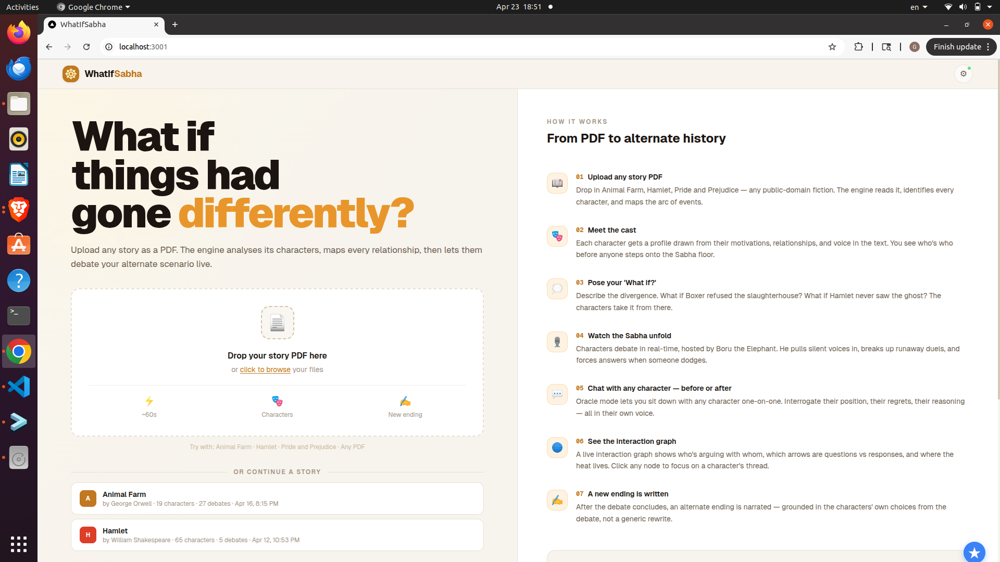
</p>

### 📥 Upload a book → auto-extracted cast

Drop a PDF. The app pulls out the characters, writes a short dossier for each, and generates a portrait per character (via Pollinations).

<p align="center">
  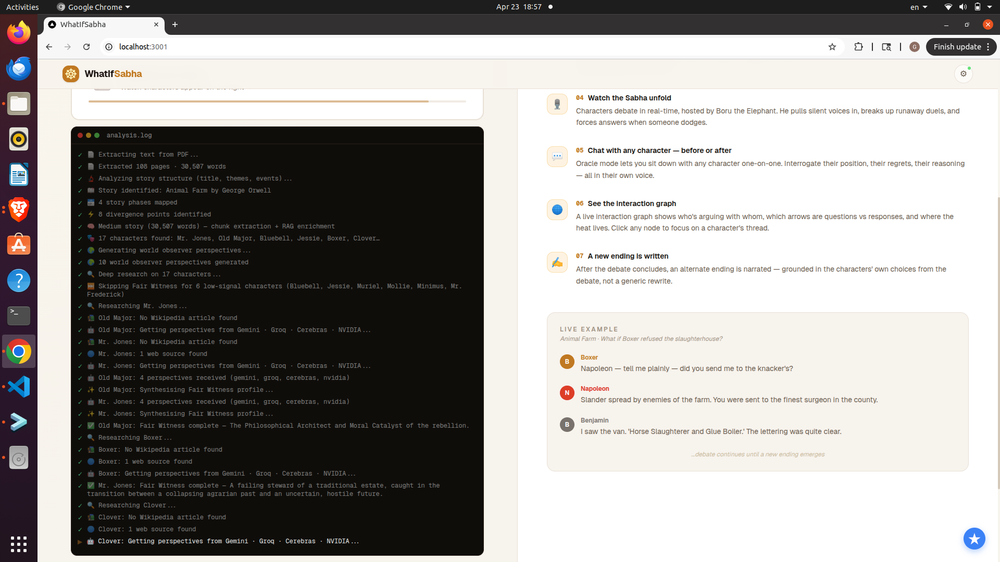
</p>

### 🏠 The story page — cast + timeline

The cast is clickable, and a short generated timeline of the original story gives the starting reality. You can also see detailed fair witness analysis on each character through internet and wiki research.

<p>
  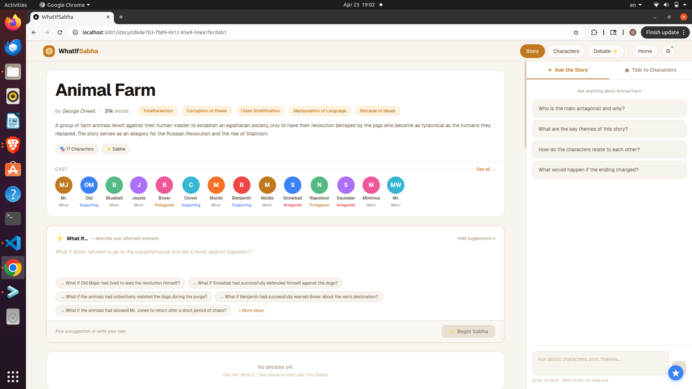
  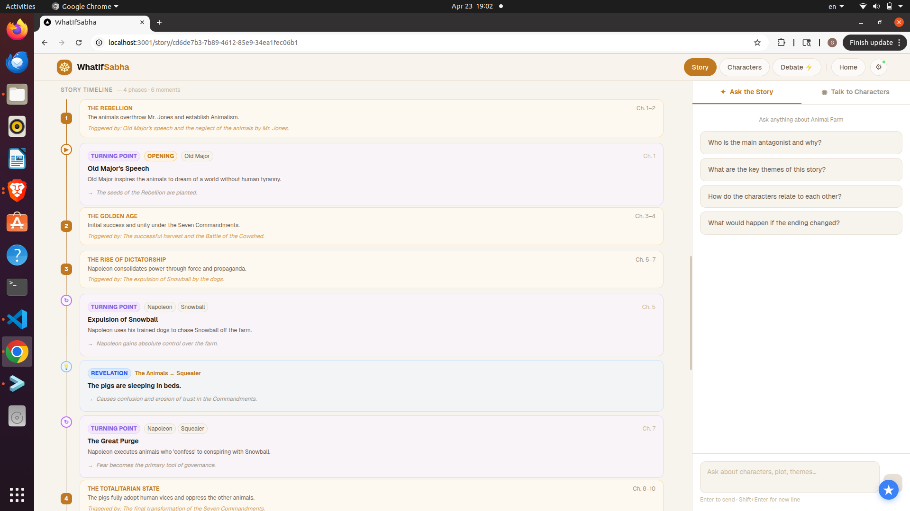
</p>

### 🐘 Ask Boru about the story (pre-debate)

Before picking a what-if, you can chat with the orchestrator about the book — he'll reason across the whole cast and remember the conversation.

<p>
  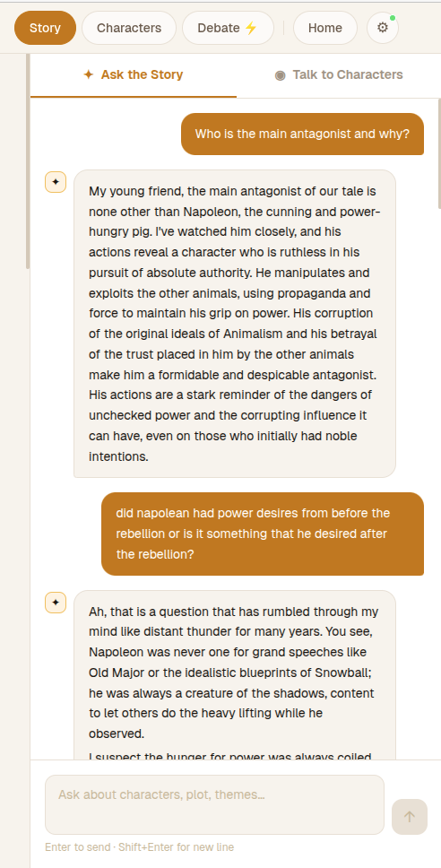
  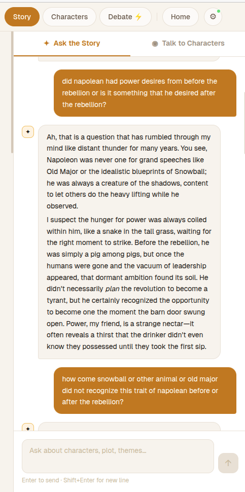
  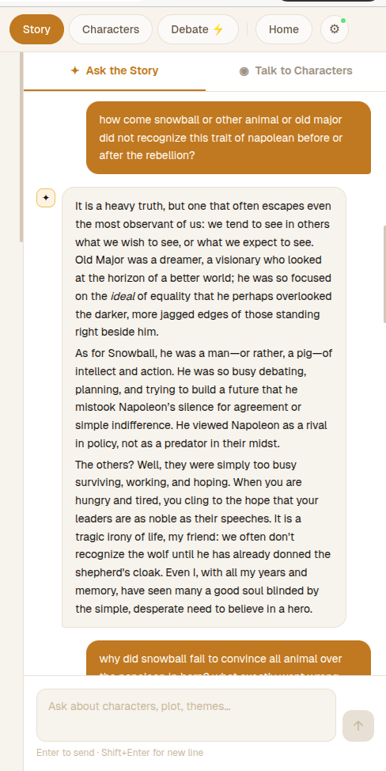
</p>

### 🎭 Talk to the characters themselves (pre-debate)

Each character is queryable individually, grounded only in what *that* character would know.

<p>
  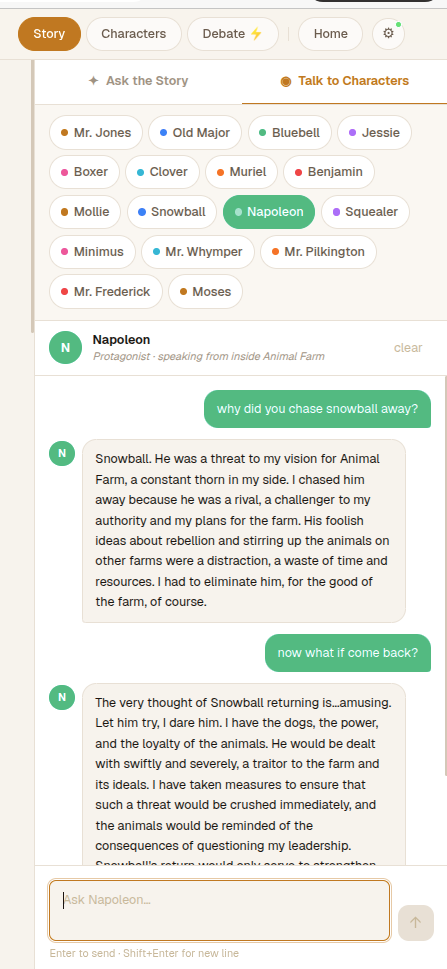
  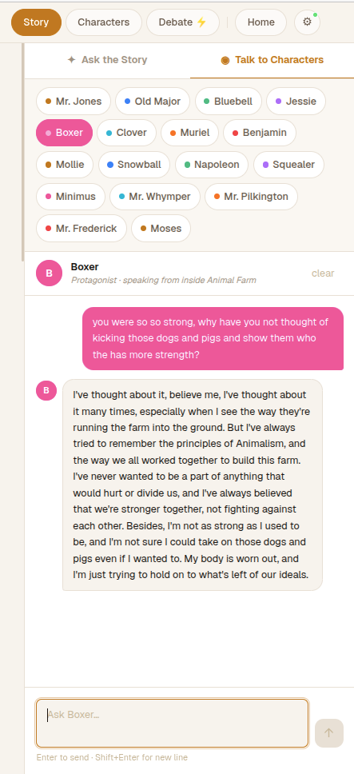
</p>

<details>
<summary>More pre-debate chats — Benjamin, Jessie</summary>
<p>
  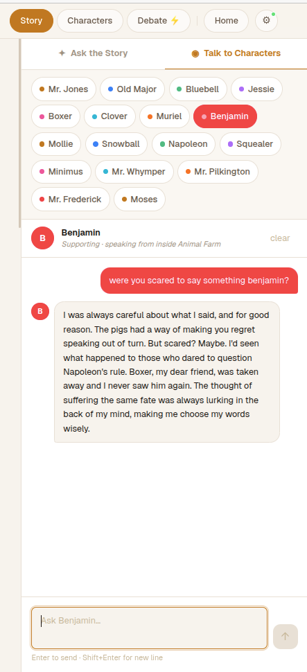
  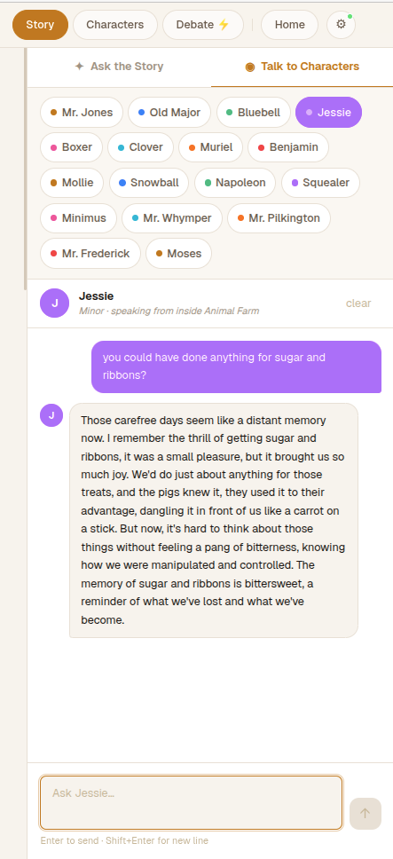
</p>
</details>

### ⚡ The live debate

Boru hosts. Characters argue. Ledger fills in real time. Graph updates per turn.

<p align="center">
  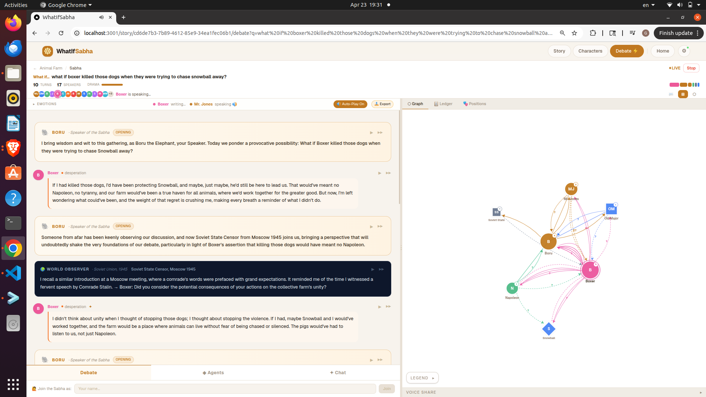
</p>

### 🌐 Interaction graph

Force-directed. Arrows styled by speech act (response vs question). Drag any node to pin it. Click a node to spotlight its outgoing arrows.

<p align="center">
  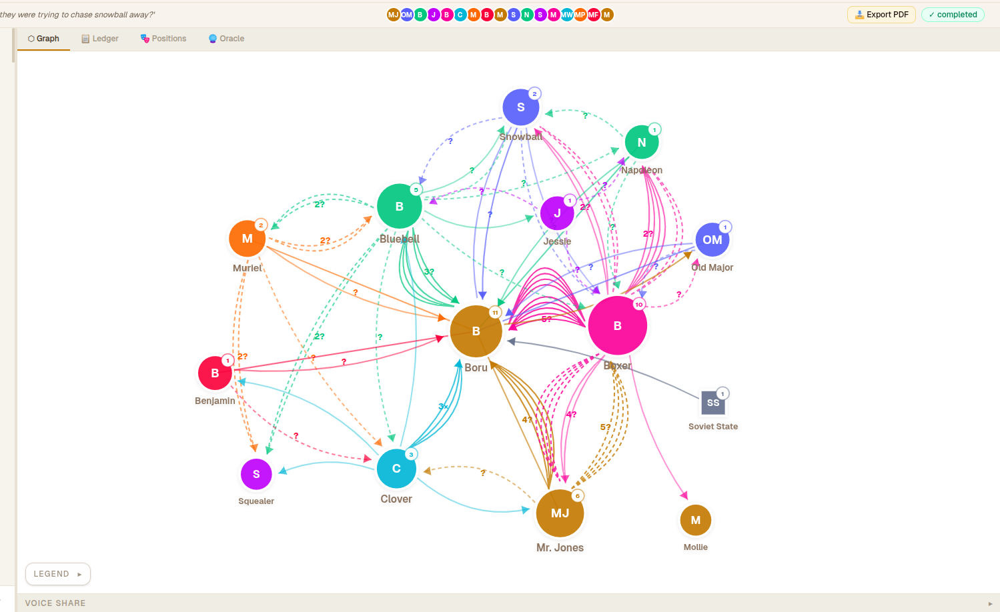
</p>

### 🔮 Oracle — talk to characters in the alternate world

After the debate closes, the world persists. Any character will answer you from *inside* the reality the debate shaped. Per-character history is kept for the session — switch between characters and come back without losing context.

<p>
  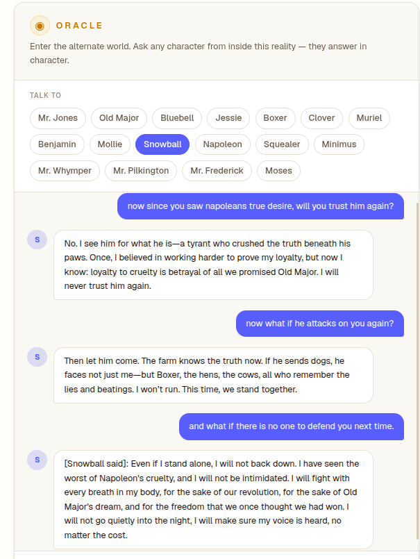
  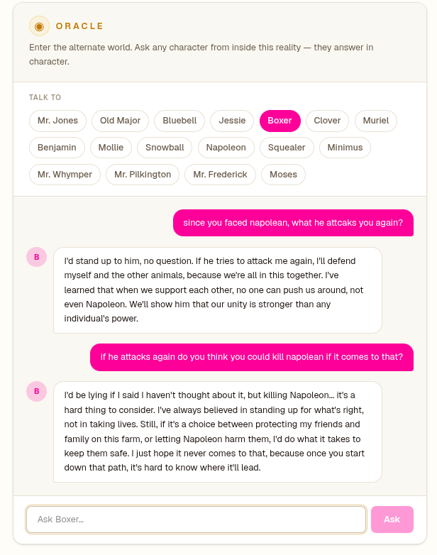
  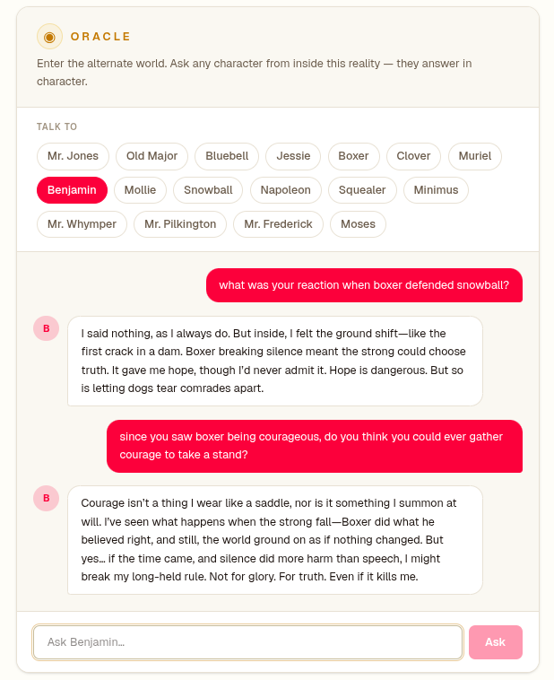
</p>

---

## ⚡ Quick start

> 🎯 **You need:** Python 3.10+ · Node 20+ · **one free API key** (under 5 minutes — see the [API keys section](#-api-keys--you-only-need-one))

### 🐳 Option A — Docker (easiest, ~3 minutes)

```bash
git clone https://github.com/wadekarg/whatif-sabha.git whatif-sabha
cd whatif-sabha
cp backend/.env.example backend/.env

# Edit backend/.env and paste any ONE of the API keys (free tiers work).
# Grab a free key at: https://aistudio.google.com/apikey  (fastest path)

docker compose up
```

**Then open** 👉 **[http://localhost:3000](http://localhost:3000)**

That's it. Upload a PDF, type a what-if, watch it debate.

---

### 🛠 Option B — Local (no Docker)

You'll run two terminals — one for the backend, one for the frontend.

**Terminal 1 — Backend:**

```bash
cd backend
python -m venv venv
source venv/bin/activate       # on Windows: venv\Scripts\activate
pip install -r requirements.txt
cp .env.example .env            # paste ONE API key into .env
uvicorn app.main:app --port 8001 --reload
```

**Terminal 2 — Frontend:**

```bash
cd frontend
npm install
npm run dev
```

**Then open** 👉 **[http://localhost:3000](http://localhost:3000)**

> 💡 **Hot tip:** If you don't want to touch `.env`, just start both servers and click the **⚙️ gear icon** in the top-right of the UI — you can paste API keys there and they'll push to the backend automatically.

---

## 🔑 API keys — you only need ONE

<div align="center">

### ✨ **The whole app runs on any single API key — from any provider, anywhere** ✨

</div>

**Six first-class providers**, free tiers in bold:

```bash
GEMINI_API_KEY=...      # 🌟 best free tier (1500 requests/day)
GROQ_API_KEY=...        # 🚀 free tier — sub-second LPU inference
CEREBRAS_API_KEY=...    # ⚡ free tier — fastest character turns
NVIDIA_API_KEY=...      # 🎯 free tier — 90+ models on NIM
ANTHROPIC_API_KEY=...   # 💳 paid — Claude (best quality)
OPENAI_API_KEY=...      # 💳 paid — GPT-4o family
```

**Plus — bring your own provider.** Anything that exposes an OpenAI-compatible `/chat/completions` endpoint works through a single generic slot:

```bash
CUSTOM_LLM_BASE_URL=https://api.deepseek.com/v1   # or wherever
CUSTOM_LLM_API_KEY=sk-...
CUSTOM_LLM_MODEL=deepseek-chat
```

This unlocks **DeepSeek · Qwen / Dashscope · Kimi (Moonshot) · Zhipu GLM · OpenRouter · Together · Fireworks · Perplexity · Ollama / LM Studio (local) · Azure OpenAI · GitHub Models · vLLM · llama.cpp** — basically any LLM provider in any country, plus self-hosted setups for full offline use.

### 🪟 Picking models in the UI

Click the **⚙ gear icon** in the top-right and the modal will:

1. Fetch the **live list of chat-capable models** from each provider you've added a key for (calls each provider's real `/v1/models` API — no hardcoded model lists in the code).
2. Show a dropdown per provider with our blessed pick marked **`(recommended)`**. First-time users can save and go.
3. Expose an **Advanced** collapsible per provider — set different models for `Character voice / Story chat / Debate moderator / Narrator-summary` if you want fine-grained routing.

Picks persist in your browser's localStorage and on the backend's runtime settings. As providers ship new models, they appear in the dropdown automatically — no app update needed.

### 🔁 Multi-provider mode

Add **more than one** key and the router builds a fallback chain: tries the user-picked model on the preferred provider for each role, auto-fails over to the next on rate-limit / quota errors. With a single key the same key just does every role — slower on long debates but fully functional.

---

## 🎭 How the debate works

Boru is the interesting part. He's not just picking the next speaker by score — he's actually enforcing a conversation. A short tour of what's in the code:

- 🎙️ **Pending-invitee enforcement** — when Boru names someone (`"Napoleon — your move"`), that character *is* the next speaker. Heuristic scoring is skipped for the turn. Boru's word is law.
- 🗣️ **Vocative routing** — phrases like `"Mrs. Jones, speak"` or `"for Mrs. Jones"` are parsed out of Boru's prose, so the intended speaker actually gets the floor. Works for character-to-character questions too: if A asks B something directly, B is pinned for the next turn.
- ⚖️ **Dispute lifecycle** — the `ArgumentLedger` tracks claim-vs-claim contradictions, escalates them through a couple of confrontation rounds, and then retires them with a pair cooldown so the same two people aren't shoved back into combat forever. Stale disputes auto-retire after ~10 untouched turns.
- 🌀 **Silent rotation** — if the cast is going quiet (40%+ haven't spoken, or three-plus have never spoken), Boru actively pulls silent characters in. The pull gets stronger the longer someone stays frozen out.
- 🔀 **Pair-duel breaker** — after five exchanges dominated by the same two voices, a third voice is forced in to break the ping-pong.
- 🌍 **World observers** — 3–4 real-world voices chosen per debate by tag-overlap with your divergence (for *Animal Farm*: a Soviet propagandist, a Trotskyist exile, a Ukrainian farmer under collectivization, a Cold War strategist) break in every 3–4 turns with historical context the characters themselves can't see.
- 🔎 **Power Interrogator** — a structural voice that fires once at the midpoint. Not moral. One question: *who benefits if this version of events is accepted as real?* Names the interested party, asks the character with the most to gain from being believed, walks off.
- 🪜 **Phase progression** — `opening → cross_examination → deepening → reckoning → closing`, driven by the ledger's state rather than raw round count.
- 🎯 **Resolution round** — before the closing, Boru forces answers to the top still-open questions.
- 👻 **Ghost-speak for dead characters** — if your divergence says "kill Napoleon", Napoleon can still appear in the debate but speaks from the grave (past/conditional tense, foretells what the living will do) instead of giving active orders.
- 🔇 **Anti-repetition** — Boru's last few openers are injected into his own prompt as a "don't start with these" list. Dispute subjects get diversified.
- 🛑 **Hard stop after closing** — once the closing is delivered, no late stage directions slip through.

This whole layer is covered by tests in `backend/tests/` (~90 tests across `test_sabha_orchestrator_return.py`, `test_orchestrator_picker.py`, `test_dispute_retirement.py`, `test_reentry_logic.py`, `test_intended_speaker_parsing.py`, `test_boru_anti_repetition.py`, `test_character_speech_act.py`).

---

## 🔊 Voice — every character has one

Each character speaks in their own voice as the debate streams. Audio is generated on the fly by **[Edge TTS](https://github.com/rany2/edge-tts)** — Microsoft's neural voice pool exposed through a free, keyless API — and played turn-by-turn in the browser. No API key, no per-turn paid provider.

**Voices aren't random.** During upload, each character is scored against a library of ~130 trait keywords across three dimensions:

- 🔥 **Energy** — how fast the character speaks. Paranoid · young · impulsive push it up; stoic · weary · grieving pull it down.
- 👑 **Authority** — how deep the pitch sits. Commanding · sage · ruthless push deeper; innocent · cowardly · timid pull higher.
- 📢 **Presence** — how loud and projected. Theatrical · defiant · aggressive fill the room; melancholy · broken · aloof fade back.

The scorer reads every personality field the app has on a character — description, role, phase traits, motivations, fears, fair-witness consensus, narrative bias — then picks a base voice from a gendered pool of **16 Edge TTS voices** and tunes rate / pitch / volume accordingly. Boru is fixed — warm, authoritative, a little slow. Napoleon comes out deep and loud; Boxer steady and workmanlike; Mollie fluttery and quick.

**Voices shift with emotion.** On top of the baseline, each turn is classified (anger, grief, pride, guilt, defiance, betrayal, contempt, cold fury, hope, weariness…) and the speaker's rate / pitch / volume are modulated for that turn. Same character, same voice, but an angry Napoleon is faster and louder than a scheming Napoleon — and a grieving Clover slows right down.

**In the UI:** every transcript line has a ▶ button and the debate page auto-plays by default. Toggle **🔊 Auto-Play On / 🔇 Auto-Play Off** from the header. Boru reads the closing summary via its own audio button on the summary card. Audio is cached per turn on the backend, so replaying a finished debate is instant.

**Pronunciation patches.** A few words that Edge TTS mishandles get phonetic swaps for TTS audio only — e.g. `sabha` → `sabhaa` to get the long Sanskrit vowel right. The on-screen transcript is never changed.

> Relevant code: [`backend/app/core/tts.py`](backend/app/core/tts.py) (profile scoring, emotion modifiers, generation), [`backend/app/api/routes/debate.py`](backend/app/api/routes/debate.py) (`/debates/{id}/tts`, `/debates/{id}/voices`, `/debates/{id}/tts/summary`), and the auto-play queue in [`frontend/app/story/[id]/debate/page.tsx`](frontend/app/story/[id]/debate/page.tsx).

---

## 🎨 Content + export features

Once the debate ends, a few things happen:

- 📝 **Summary narrator** — synthesizes a prose summary using the full ledger, not just the transcript tail.
- 🔮 **Oracle Q&A** — keep asking any character from the alternate timeline questions; they answer in-character, grounded in what was argued. Per-character history persists for the session.
- 🌐 **Live interaction graph** — force-directed, updating per turn. Arrows styled by speech act (question vs response vs statement).
- 📋 **Boru's notes timeline** — his progress notes from every round, kept as a history you can scroll through.
- 📄 **PDF export** — builds a bound PDF with: title page, the real D3 graph (not a synthetic stand-in), cast strip, full transcript, ledger page with notes + open questions + claims, positions page, and the summary.
- 🌍 **Static replay site** — the `replay/` subproject is a Next.js static export with its own multi-page tour (story · characters · debate replay) and pre-rendered Edge TTS audio bundled in, so the [hosted demo](https://whatif-sabha.pages.dev) plays voices without any backend. Deploy to Cloudflare Pages for a zero-backend shareable replay.

---

## 🛠️ Config reference

Everything lives in `backend/.env` (see `backend/.env.example`). You only need **one** of the API keys; multiple enables failover.

### 🔑 API keys

| Variable | Purpose |
|---|---|
| `GEMINI_API_KEY` | 🌟 Google Gemini — good all-rounder, best free tier |
| `CEREBRAS_API_KEY` | 🧠 Cerebras — ultra-fast character turns |
| `GROQ_API_KEY` | 🚀 Groq — fast judge/narrator |
| `NVIDIA_API_KEY` | 🎯 NVIDIA NIM — broad model selection |
| `ANTHROPIC_API_KEY` / `OPENAI_API_KEY` | 💳 Optional paid fallbacks |
| `CUSTOM_LLM_BASE_URL` / `CUSTOM_LLM_API_KEY` / `CUSTOM_LLM_MODEL` | 🌍 Bring your own — any OpenAI-compatible endpoint (DeepSeek, Qwen, Kimi, OpenRouter, Ollama, LM Studio, Azure OpenAI…) |

### 🎛️ Model overrides (optional — UI picker is the recommended path)

Per-provider env-var overrides for users who'd rather not click. The gear-modal pick takes precedence over these if both are set.

| Variable | Purpose |
|---|---|
| `ANTHROPIC_MODEL` / `OPENAI_MODEL` / `GEMINI_MODEL` / `GROQ_MODEL` / `CEREBRAS_MODEL` / `NVIDIA_MODEL` | Pin a specific model for that provider across all roles |

### ⚙️ App settings (all optional — defaults work)

| Variable | Default | Purpose |
|---|---|---|
| `DATABASE_URL` | `sqlite+aiosqlite:///./whatif_sabha.db` | Persistence |
| `UPLOAD_DIR` | `./uploads` | PDFs + generated portraits |
| `MAX_UPLOAD_SIZE_MB` | `50` | Upload cap |
| `ALLOWED_ORIGINS` | `localhost:3000, localhost:3001` | CORS |
| `ANALYSIS_MODEL` / `CHARACTER_AGENT_MODEL` / `JUDGE_MODEL` / `NARRATOR_MODEL` | *(set in .env.example)* | Legacy role-based model env vars — preserved for backwards compat |
| `NEO4J_URI` / `NEO4J_USER` / `NEO4J_PASSWORD` | — | Enables Graphiti character memory |
| `ENABLE_LIGHTRAG` | off | Narrative causal graph at upload (~60s) |
| `REDIS_URL` | — | Optional caching layer |

### Frontend

| Variable | Default | Purpose |
|---|---|---|
| `NEXT_PUBLIC_API_URL` | `http://localhost:8001` | Backend URL |

---

## 🧠 Stack

- 🐍 **Backend** — Python 3.10+, FastAPI, uvicorn, SSE streaming
- ⚛️ **Frontend** — Next.js 16, TypeScript, Tailwind 4, D3 / force-graph
- 💾 **State** — SQLite (debates, turns, characters) + ChromaDB (per-character RAG over story text). Optional Graphiti + Kuzu for persistent character "soul memory".
- 🤖 **LLMs** — a provider router across **Gemini · Cerebras · NVIDIA NIM · Groq · Anthropic · OpenAI** plus a **bring-your-own slot** for any OpenAI-compatible endpoint (DeepSeek, Qwen, Kimi, OpenRouter, Ollama, LM Studio, Azure OpenAI…). Model picks per provider come from a **live `/v1/models` dropdown** in the gear modal — no hardcoded model ids in the code, the list updates as providers ship new models. Role-based routing (character / judge / narrator / analysis), per-role overrides under "Advanced", automatic failover on rate-limit / quota.
- 🖼️ **Character portraits** — generated via [Pollinations](https://pollinations.ai) during upload. Free, no API key. Generation is best-effort — a few portraits may not come through on any given upload; those characters fall back to an initials avatar.
- 🔊 **Voice** — free, keyless TTS via Microsoft Edge (`edge-tts`). 16-voice pool, personality-driven base assignment across energy/authority/presence dimensions, emotion-driven per-turn modulation, audio cached to disk per turn.

**Subprojects:**

| Folder | What it is |
|---|---|
| `backend/` | FastAPI app, debate engine, agents, routes, persistence |
| `frontend/` | Next.js app — upload, story pages, live debate, graph, PDF export |
| `replay/` | Separate Next.js static export for hosted replays (Cloudflare Pages) |
| `demo/` | Standalone HTML demo page |

---

## 🧪 Running tests

```bash
cd backend
source venv/bin/activate
pytest tests/ -v

# Replay-site tests
cd ../replay && npm test
../backend/venv/bin/pytest scripts/test_export_debate.py
```

The backend suite covers the moderator/picker logic — re-entry triggers, dispute lifecycle, vocative parsing, anti-repetition, speech-act classification, Boru return paths. The content agents (character / narrator / judge) are verified by eye, not by unit tests.

---

## 📥 What I've tested it on

| Story | Cast | Example divergences |
|---|---|---|
| 🐷 *Animal Farm* | Napoleon, Snowball, Boxer, Squealer, Clover, Benjamin, Mr. Jones | *"What if Snowball returned?"* · *"What if the pigs stayed honest?"* |
| 🗡 *Hamlet* | Hamlet, Claudius, Gertrude, Ophelia, Horatio | *"What if Hamlet acted on the ghost immediately?"* |
| 📚 **Any PDF** | Auto-extracted | You write the divergence. |

The multi-pass character extractor handles longer PDFs by chunking, so you can try your own books — just be mindful of the copyright note below.

---

## 🆘 Troubleshooting

<details>
<summary><b>The debate seems stuck or isn't streaming</b></summary>

1. Check that the **backend is running** on `localhost:8001`. Open [http://localhost:8001/health](http://localhost:8001/health) — you should see `{"status":"ok"}`.
2. Check the **browser console** for SSE/EventSource errors — usually a CORS or network issue.
3. If you're on a corporate/VPN network, SSE connections can hang. Try a different network.
</details>

<details>
<summary><b>"Rate limit" errors mid-debate</b></summary>

- You're hitting the free-tier minute cap of your provider. Two options:
  - Add a second API key from another provider to `.env` — the router will auto-failover.
  - Wait a minute and retry the debate.
</details>

<details>
<summary><b>The character cast extraction is missing someone</b></summary>

- The analyzer uses a multi-pass chunking strategy. Very long books with many minor characters can drop the long tail.
- You can also edit `backend/whatif_sabha.db` directly or re-upload a smaller PDF covering a specific section.
</details>

<details>
<summary><b>PDF export looks blank or ugly</b></summary>

- The exporter captures the live SVG graph — make sure the Graph tab is visible when you click Export.
- If you see "html2canvas failed" in the console, it's likely a CORS issue with a portrait image URL.
</details>

<details>
<summary><b>Reset everything</b></summary>

```bash
cd backend
rm whatif_sabha.db
rm -rf chroma_db uploads
```

Nukes the database, the per-character embeddings, and any uploaded PDFs. Start fresh.
</details>

<details>
<summary><b>Frontend dev server is unresponsive / hung</b></summary>

Turbopack sometimes gets into a bad state. Fix:

```bash
cd frontend
rm -rf .next
npm run dev
```
</details>

---

## 🔒 Known limitations

Keeping this honest — it's a side project, not a product.

- **Not every story has been tested end-to-end.** Tuning has focused on short works like *Animal Farm* and *Hamlet*. Longer books may surface rough edges in extraction or pacing.
- **No authentication.** Single-user prototype — don't put it on the public internet as-is.
- **SQLite + ChromaDB on disk.** No multi-tenancy. Resetting means clearing `backend/whatif_sabha.db`, `backend/chroma_db/`, and `backend/uploads/`.
- **AI-synthetic default fixtures.** Bring your own PDFs for real runs.
- **Rate limits on free tiers.** Depending on which provider you're using, a long debate can bump into per-minute limits. The router falls back to other configured providers automatically, but with only one key configured you may see slowdowns.

---

## ⚖️ On the content

Everything a debate produces is **AI-generated**. The characters you see arguing are language models role-playing based on the PDF you upload — nothing they say appears in the source book, and none of it should be quoted as the author's words.

The demo debates in this repo were tested on George Orwell's **Animal Farm**, which entered the public domain in 2021 (US / UK / most EU jurisdictions after Orwell's life + 70 years). If you want to try the app on a book, please stick to works that are public domain or that you have permission to use. WhatIfSabha doesn't ship with any book — you upload your own PDF.

If you believe this project uses something it shouldn't, open an issue and I'll address it.

---

## 👋 A side-project note

I work on this in spare time, between other things. It started as a small curiosity — what if the characters themselves could argue about an alternate ending? — and it's grown in the directions I've been curious about on whatever given weekend. That means some parts are very polished (the moderator, the dispute ledger, the test suite around them) and some parts are rough (narrator prose, UI polish in places, docs). Issues and ideas are very welcome. If something breaks, drop the story, divergence, and provider combo in the issue — that's usually enough to reproduce.

If you try it with a book you love and something surprising happens, I'd genuinely love to hear about it.

---

<div align="center">

### 🌟 If you've read this far — thanks. Try it with a book you can't let go of.

[](https://whatif-sabha.pages.dev)
[](https://github.com/wadekarg/whatif-sabha)

**MIT License** — see [LICENSE](LICENSE). Copyright (c) 2026 Gajanan Wadekar.

</div>
